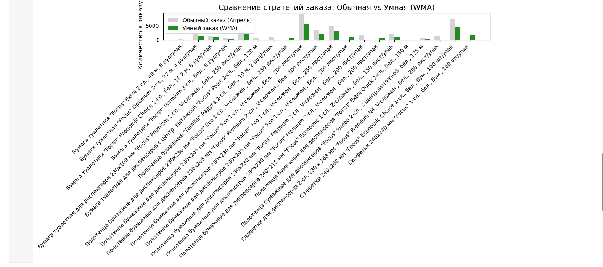

Supply Chain Optimization: Автоматизация закупок и динамическая политика запасов
📌 О проекте

Данный проект представляет собой систему поддержки принятия решений (DSS) для отдела закупок и управления цепями поставок. 

Цель — трансформация рутинного процесса формирования заказов в автоматизированный алгоритм, который оптимизирует оборотный капитал и минимизирует риски человеческого фактора.

🛠 Технический стек

Python (Pandas, NumPy): Глубокая очистка данных (ETL), обработка сложных Excel-структур (объединенные ячейки, нормализация типов).
Data Forecasting: Модель взвешенного скользящего среднего (WMA) с коэффициентами 0.5 / 0.3 / 0.2 для точного учета рыночных трендов.
Business Logic: Динамический ABC-анализ, расчет страховых запасов, учет товаров в пути (In-Transit) и кратности логистических единиц (паллеты).

 Ключевой функционал:
 
Smart Forecasting (WMA): Алгоритм анализирует продажи за 90 дней, отдавая приоритет последнему полному месяцу. Это позволяет системе быстрее реагировать на рост спроса и сглаживать случайные всплески.

Динамическая политика запасов (Dynamic Inventory Policy):

Автоматическое проведение ABC-анализа по прогнозной выручке.
Адаптивные нормативы: Алгоритм самостоятельно назначает горизонт планирования:
Категория A (80% выручки): Запас на 30 дней (максимальный уровень сервиса).
Категория B (15% выручки): Запас на 21 день.
Категория C (5% выручки): Запас на 14 дней (минимизация замороженного капитала).

Автоматизация заказов: Расчет потребности с учетом остатков (свободных и в резерве) и автоматическое округление до кратности паллет (логика ОКРВВЕРХ).
 
 Результаты и бизнес-эффект (Case Study):
На тестовом датасете поставщика «Хаят Маркетинг» внедрение модели показало следующие результаты:
Категория ABC	Кол-во SKU	Средний норматив (дн)	Итог заказа (шт)	Стратегия
A 	12	30.0	52 446	Фокус на наличии и доходности
B 	8	21.0	3 960	Сбалансированный запас
C 25	14.0	6 827	Экономия оборотного капитала
Ключевой инсайт: Благодаря снижению норматива для 25 позиций категории "C", удалось высвободить складские площади и сократить избыточные закупки, сохранив при этом 100% уровень сервиса для критически важных товаров категории "A".

📈 Визуализация

